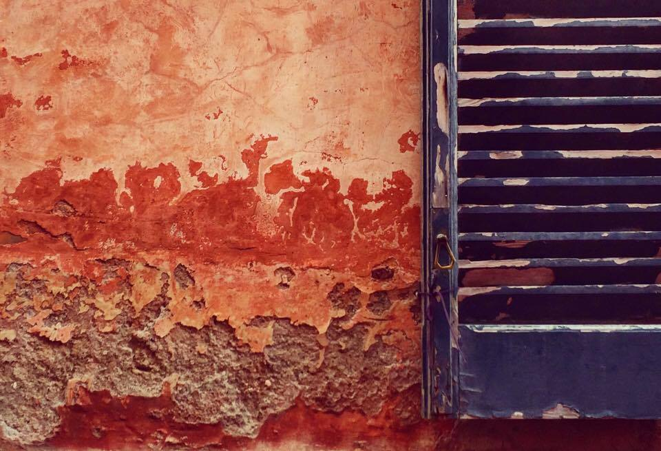

# Canti popolari della Penisola Sorrentina

.

A selection of folk poetry from Sorrento Peninsula, with [my](https://robertoreale.me) translation (from Neapolitan into Italian) and notes. It is a work in progress.

You can read it online both [here](manuscript/SUMMARY.md) and on [GitBook](https://robertoreale.gitbooks.io/sorrento). The cover image is a picture by my dearest friend Francesco Saverio Gargiulo.

Please feel free to fork the [source repository](https://github.com/robertoreale/sorrento) if there are any edits you should love to suggest!

This work is licensed under a <a rel="license" href="http://creativecommons.org/licenses/by-sa/4.0/">Creative Commons Attribution-ShareAlike 4.0 International License</a>.

